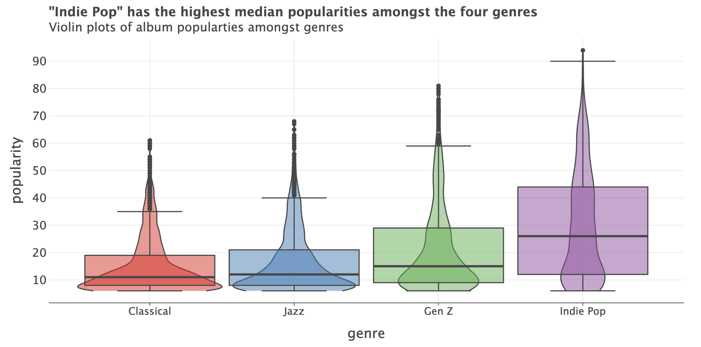
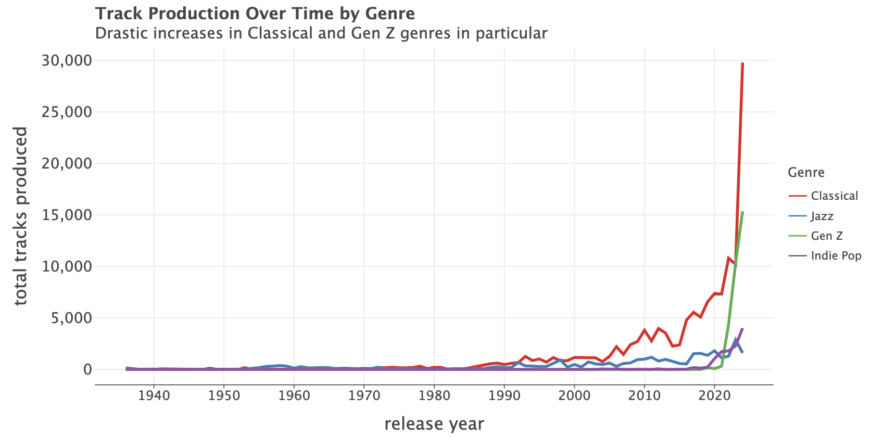
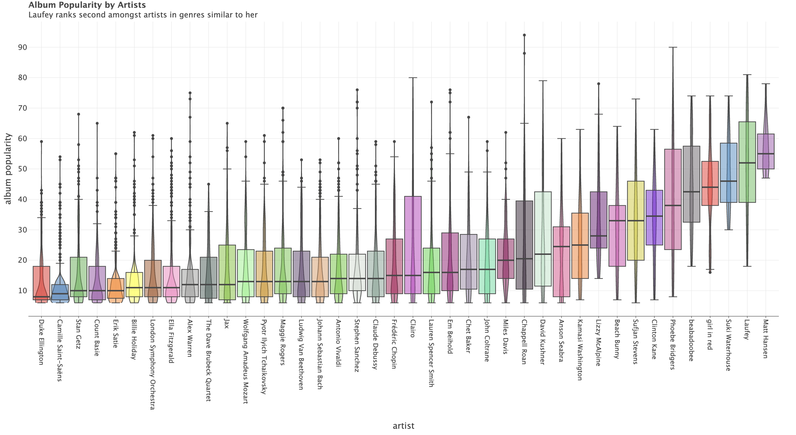
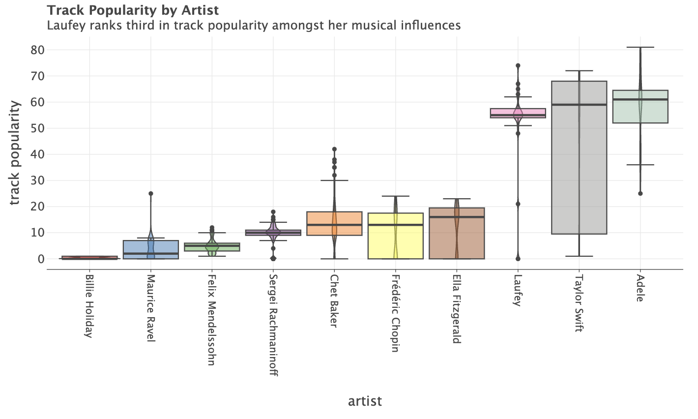
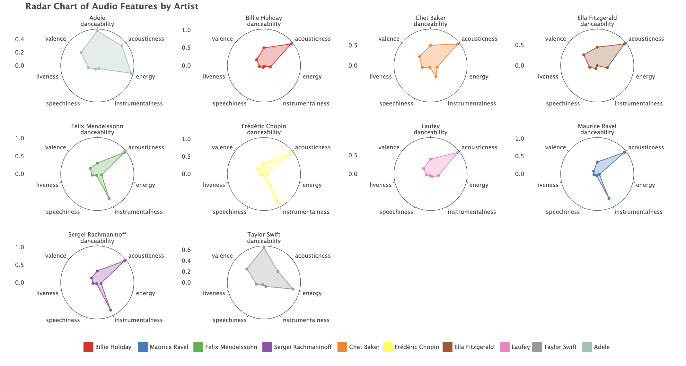
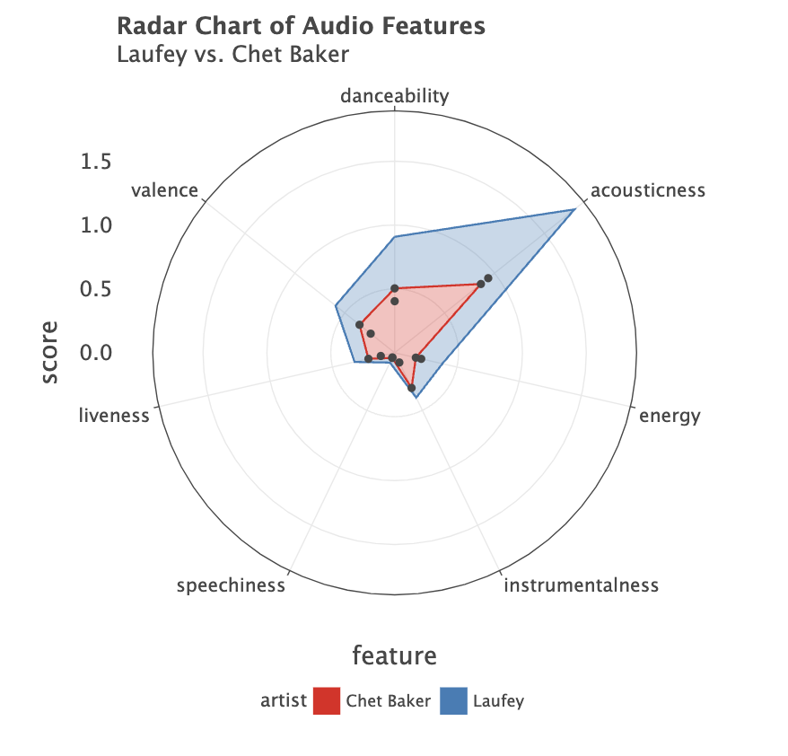
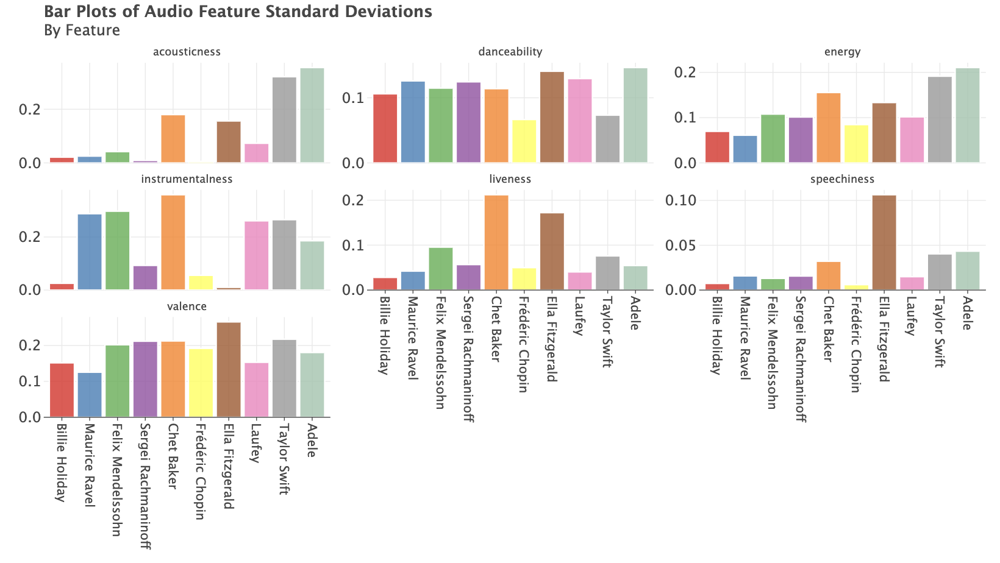
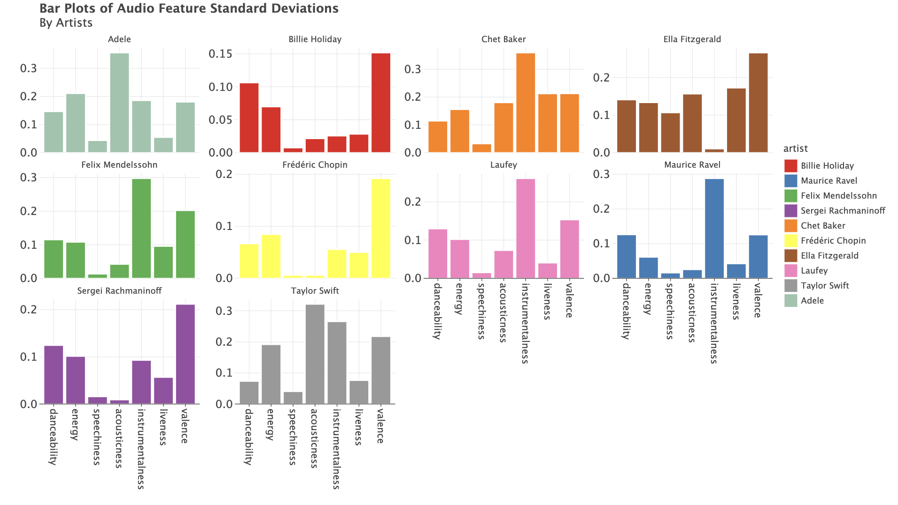
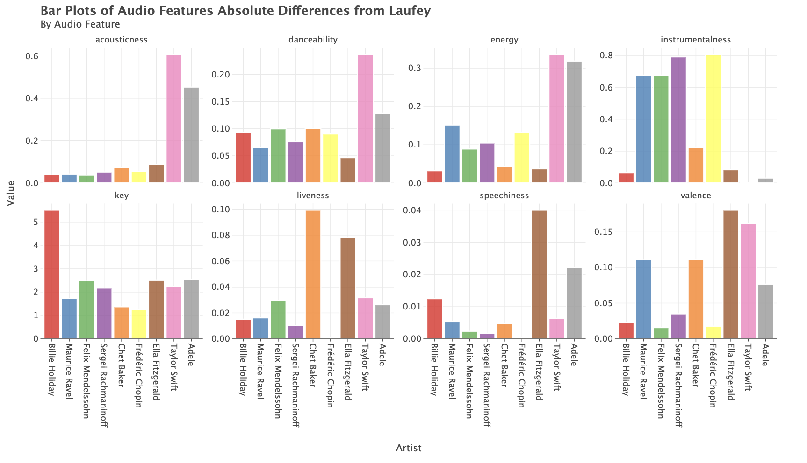

<head>
    <meta charset="UTF-8">
    <meta name="viewport" content="width=device-width, initial-scale=1.0">
    <meta charset="UTF-8">
    <meta name="viewport" content="width=device-width, initial-scale=1.0">
    <link rel="stylesheet" href="./styles.css">
    <title>Spotify Laufey Analysis</title>
    <link href="https://fonts.googleapis.com/css2?family=Nunito+Sans:wght@400;700&display=swap" rel="stylesheet">
    
</head>

<body>
    <header>
        <h1>Laufey: Classical Music and Jazz's Ambassador in Today's World</h1>
        
David Cho

    </header>

    <main>
        <h2>Introduction</h2>
        
Laufey Lin is an Icelandic musician that has been making significant noise within the music world. Known for her unique style, she has quickly risen the musical ranks, most notably, winning a Grammy for Best Traditional Pop Vocal Album for "Bewitched" in 2023. Just only in 2020, she was recording covers back home during the pandemic; but now, she is known world-wide and has performed with some of the best orchestras and collaborated with the top artists. In a time where Classical music and Jazz are no longer as popular as they once were, Laufey has brought attention to these genres; her music is completely unlike any other in today's music world. She has created an intimate connection with her fans through her unique presence on TikTok and other social media platforms. Defying music genres and influencing the new wave of music, Laufey said the following in an interview with TimeOut:

        <blockquote>
            
“My fans come [to my shows], and often it’s their first time seeing a live orchestra play – my hope is maybe they’ll come back next week and listen to a Mahler symphony or something. I like to keep the message that music is just music. Back in the day, classical music was just pop. It can just be something that follows you through the day, or lifts your spirits or makes you feel something. And there really is nothing more powerful than seeing a live orchestra.”

        </blockquote>

        <h2>Methodology</h2>
        
The data was collected from the Spotify API, covering album, artist, and track data. Furthermore, artist representation of genres was determined by a web scraping of <a href="https://www.musicmetricsvault.com/" target="_blank">Music Metrics Vault</a>. The analysis includes:

        <ul>
            <li>Genre album popularities comparisons</li>
            <li>Artist track popularities comparisons</li>
            <li>Track audio feature comparisons</li>
        </ul>

        <h2>Results</h2>

        <h3>Genre Popularity Analysis</h3>
        
        
<strong>Indie Pop:</strong> Has the highest median album popularity score and has the most popular album.

        
<strong>Gen Z:</strong> Has the second highest median album popularity score.

        
<strong>Classical & Jazz:</strong> Have the lowest median popularities and the narrowest distributions.

        <h3>Track Production by Genres over Time</h3>
        
        
The graph is rather unexpected; it is also quite misleading as there would be no reason for more Classical music track productions (as the majority Classical music that is consumed was produced by deceased composers); this number is also inflated by the nature of Classical music output (composers like Haydn and Mozart produced hundreds of compositions and each piece is considered 4 tracks because of each movement).

        
However, the relative much higher growth of Gen Z to Jazz is expected.

        
In all, the graph shows a healthy production of the genres, thus indicating that though Classical music and Jazz are not as popular as other genres, they are not dying breeds of music.

        <h3>Artist Album Popularity Distribution</h3>
        
        
<strong>Laufey</strong> ranks second amongst artists in genres similar to her; she ranks far higher than any Classical and Jazz musician.

        
The highest ranked Jazz musician (Chet Baker) ranks 17th while the highest ranked Classical musician (Chopin) ranks 21st.

        
Generally, the Classical and Jazz musicians have smaller standard deviations of popularity scores and are centered around much lower popularity scores.

        <h3>Artist Track Popularity Distribution</h3>
        
        
Similarly, Laufey ranks third amongst her musical influences for track popularity.

        
Her track popularity distribution is very narrow and centered very high.

        <h3>Audio Features Analysis</h3>
        
        
Laufey's audio features are shaped most closely to Billie Holiday, Chet Baker, and Ella Fitzgerald, perhaps indicating a similarity closer to Jazz than Classical music (as all three of those artists of Jazz musicians).

        
However, besides the instrumentalness feature, her audio feature shape also resembles those from Classical music as well (Mendelssohn, Rachmaninoff, Chopin, Ravel).

        <h3>Laufey vs. Chet Baker</h3>
        
        
A closer inspection of the graph allows to see even more how closely their audio features are.

        <h3>Audio Feature Standard Deviation Analysis (by feature)</h3>
        
        
Laufey's standard deviation for acousticness is on the lower side; this is similar to the Classical musicians (whose standard deviation is all very close to 0).

        <h3>Audio Feature Standard Deviation Analysis (by Artist)</h3>
        
        
Laufey's standard deviation distribution shape is most similar to Sergei Rachmaninoff, Maurice Ravel, and Felix Mendelssohn's.

        <h3>Laufey Audio Feature Deviation Analysis</h3>
        
        
<strong>Acousticness:</strong> Taylor Swift and Adele had the greatest differences in mean acousticness; this makes sense as these are pop artists while the others are Jazz and Classical.

        
<strong>Danceability:</strong> Similar trends with acousticness.

        
<strong>Frédéric Chopin:</strong> Had negligible differences in both liveness and speechiness.

        <h2>Discussion</h2>
        
The analysis reveals that Laufey performs unusually well for a musician that produces Classical and Jazz influenced music. Though the Classical music and Jazz genres as a whole are clearly less popular than other genres, Laufey produces tracks that perform well above these genres' normal expectations. Her music is clearly influenced by Classical and Jazz features, as seen by the audio feature comparisons.

        <h2>Conclusion</h2>
        
This study provides insights into Laufey's popularity and track audio features in relation to Classical music and Jazz. This further supports her uniqueness within the current music world and cements her impact in the next wave of music trends. However, the limitations of this analysis must be acknowledged; much informative information (such as artist follower count over time) could not be used due to limited data provided by the Spotify API and the audio feature analysis oversimplifies the complexities of music (it cannot simply be characterized by those features, which features themselves probably cannot be said to objectively measure a certain song). Future studies could expand on this analysis by comparing more genres and artists (the database of this analysis was limited due to time), and perhaps looking outside of the Spotify API to look for other types of music data. For a look into all the graphs produced, look into the figures folder.

